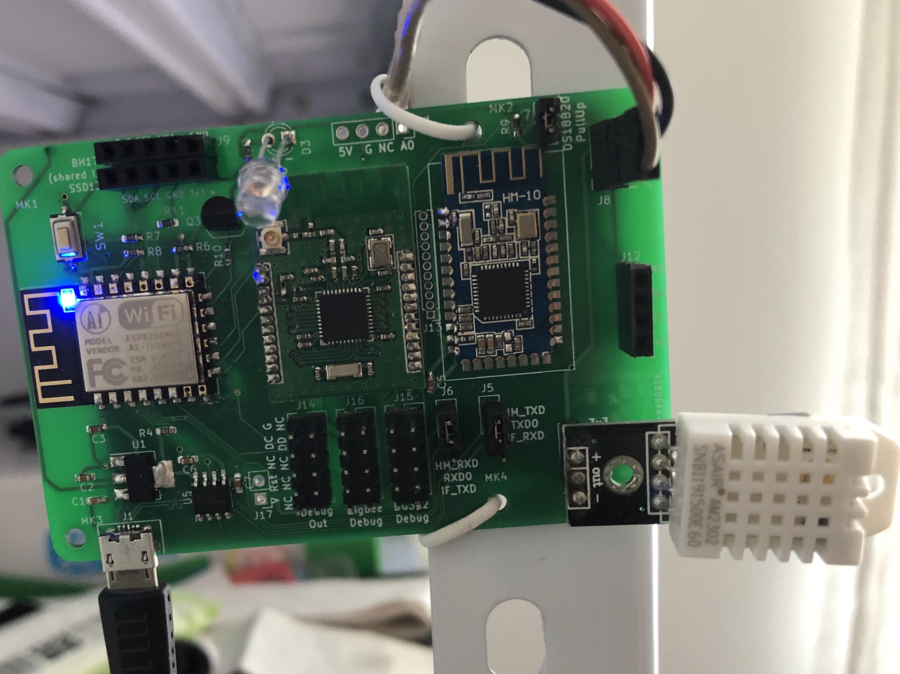
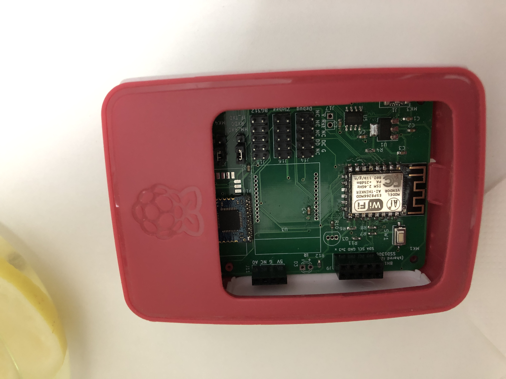
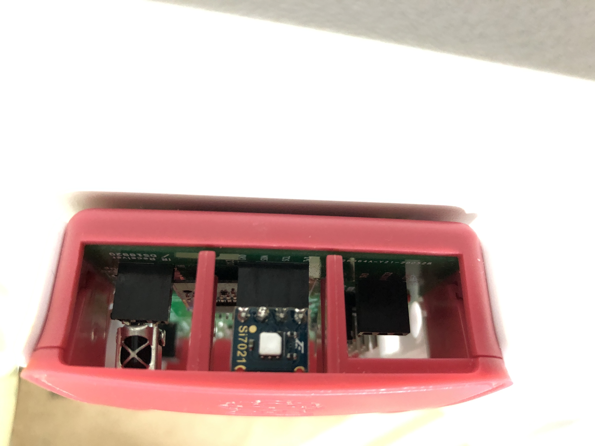
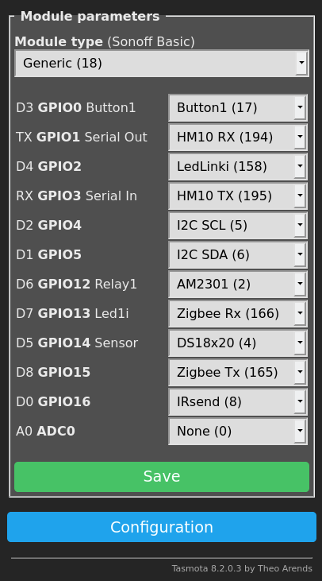

# sensor-hub

This is an ESP8266 board with some connectors for sensors.

The board is made with Raspberry Pi 3 form factor so it can fit into a Raspberry Pi 3 B shell easily if you want.

# Hardware

The board itself is design in KiCAD. Note, I am not a profession in electronics, so the board can be error pron or unstable.

The kicad symbol of the button is from [this website](http://smisioto.no-ip.org/elettronica/kicad/kicad-en.htm). You need to download the package/symbol and config it in your KiCAD.

# Firmware

[Tasmota](https://github.com/arendst/Tasmota) fits me well for gathering the sensor information and send it via MQTT. You can either download one from Tasmota, or compile your own for your need.
The config I use for [TasmoCompiler](https://github.com/benzino77/tasmocompiler) docker based compiler is available as `firmware/tasmota-zigbee-ir-i2c-user_config_override.h` .

The following is the config I use for the first picture.

